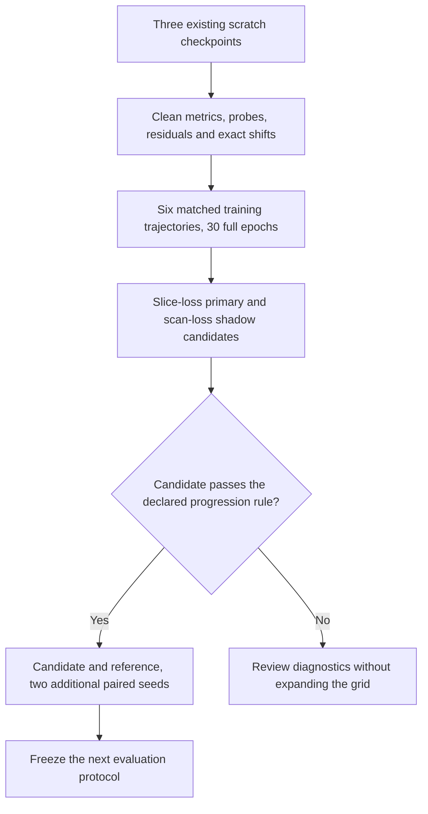

# ConvNeXt feature and selection experiments

The next investigation separates checkpoint selection, learning-rate timing and feature extraction. Reuse existing scratch checkpoints first, then screen six controlled training trajectories on frozen fold-1 train and early-stop roles. `../config/experiment_plan_v2.json` is the fixed specification consumed by `run_feature_experiments.py`. The legacy 17-case runner remains independent.

## Investigation sequence



## Evidence and questions

The real job-633000 [comparison table](https://drive.google.com/file/d/1UW6IokKO05DcVsOfFKu5GXIsS3PxgEii/view) and [review](https://drive.google.com/file/d/1kkr5wEGYYCh_5atB_70XOYvN85hMpCyz/view) provide the starting evidence:

- CNN slice accuracy/AUROC: 75.43% / 0.8049; Lite reference: 62.82% / 0.6251. These configured baselines are not matched architecture-only ablations.
- Integer-shift Lite: 64.95% / 0.6479, but patient accuracy falls from 30/38 to 27/38. Its small slice gain is not established as stable across seeds.
- The combined sampling/integer/gamma arm averages 56.58% accuracy across three seeds. Do not expand that arm in this round.
- Warmup/cosine stops at epoch 7 with LR still 94.7% of base; its planned low-LR phase was not observed.
- Scan log loss selects epoch 1 in the sampling/integer arm despite higher slice accuracy/AUROC later. This mismatch does not explain the reference or integer-shift Lite, whose selected epochs also maximize their logged slice accuracy.

Hypotheses: transferable features are weak; stem/downsampling introduces phase or boundary sensitivity; the selection objective prefers a different tradeoff from slice classification; or optimization/regularization leaves the residual representation poorly adapted. None is an established causal or clinical explanation.

## Common protocol

Keep `adni_splits_v1` unchanged. Fold 1 has 343 training patients / 745 scans / 14,900 slices and 38 early-stop patients / 94 scans / 1,880 slices. Outer validation, calibration and final-test scoring stay closed throughout screening and repeats. Mandatory source-integrity auditing may verify all roles without scoring them.

Keep native 240 x 256 grayscale input, the existing fixed mapping `(uint8/255 - .5)/.5`, slice-uniform training order, no augmentation, AdamW, batch 32, two workers and two CPU threads. Preserve BCE positive weight 7520/7380. Use float32, the existing single-logit head, zero label smoothing and random initialization. No pretrained or inherited trained weights.

Keep Lite depths (2,2,6,2), widths (48,96,192,384), LayerScale initialization 1e-6 and maximum DropPath .1 except in its explicit ablation. Do not simultaneously add AMP, crops, flips, MixUp, CutMix, attention, RoPE, gamma or balanced sampling.

Screening seed base is 3710; the current fold offset makes actual training seed 3711. Every core case uses 30 full epochs without patience truncation. Thirty is the declared experiment budget, not a course requirement. The existing CLI can complete this budget with `--epochs 30 --patience 30`; the new paired-output runner must explicitly record fixed-budget scope. With batch 32 and no dropped batch: 466 optimizer steps per epoch / 13,980 per trajectory.

Retain existing CLI defaults and old `best.pt` meaning. Implement these controls in a separate runner or explicit opt-in mode before launching; do not silently change historical results or aliases.

## Stage A existing checkpoint diagnostics

Use server checkpoints from `$HOME/comp3710/runs/convnext_suite_job633000`:

| ID | Checkpoint | Purpose |
|---|---|---|
| D00 | E00_cnn_attempt_01/best.pt | Configured CNN baseline |
| D01 | E01_lite_reference_attempt_01/best.pt | Unaugmented scratch Lite |
| D02 | E09_integer_shift_attempt_01/best.pt | Integer-shift scratch Lite |

Run existing tools on all training and all early-stop scans. Evaluate unchanged backbones with augmentation and DropPath disabled. Fixed 200-epoch linear probes use only training-patient mean embeddings, LR .01 and WD .01; patient-level probe AUROC is a diagnostic, not the primary slice-model result. `diagnose.py` already exports post-LayerScale residual/skip ratios and learned scale ranges.

On an allocated GPU with the `torch` environment active, these commands match current CLIs and do not train a new backbone:

```bash
set -euo pipefail
adni_source="$HOME/comp3710/comp3710-adni"
adni_previous="$HOME/comp3710/runs/convnext_suite_job633000"
adni_output="$HOME/comp3710/runs/feature_v2_$(date -u +%Y%m%dT%H%M%SZ)"
cd -- "$adni_source"
for adni_case in E00_cnn E01_lite_reference E09_integer_shift; do
    python -u diagnose.py \
        --checkpoint "$adni_previous/${adni_case}_attempt_01/best.pt" \
        --data-root /home/groups/comp3710/ADNI \
        --splits-dir "$HOME/comp3710/adni_splits_v1" \
        --output "$adni_output/$adni_case/features" \
        --device cuda --batch-size 32 --workers 2 --threads 2 --seed 3710 \
        --max-train-patients 0 --max-early-patients 0 --max-scans-per-patient 0 \
        --max-transform-images 12 --shift-pixels 0 --probes \
        --probe-epochs 200 --probe-lr .01 --probe-weight-decay .01
    python -u diagnose_followup.py \
        --checkpoint "$adni_previous/${adni_case}_attempt_01/best.pt" \
        --data-root /home/groups/comp3710/ADNI \
        --splits-dir "$HOME/comp3710/adni_splits_v1" \
        --reference-dir "$adni_output/$adni_case/features" \
        --output "$adni_output/$adni_case/spatial" \
        --routes spatial --device cuda --batch-size 32 --workers 2 --threads 2 \
        --seed 3710 --max-shift 8 --bootstrap-samples 1000
done
```

Sweeps cover horizontal/vertical +/-1 through +/-8 pixels with zero-filled exact integer moves and round-trip controls: 65 forwards per slice, including original and round trips. Report the common full cohort and foreground-margin proxy subsets with denominators. Reversible source pixels do not exclude internal-padding effects.

Exact feature alignment requires displacement divisibility by the layer's actual stride. Current strides are 4,8,16,32. Within an 8-pixel sweep, nonzero exact alignment is available only for stem/stage 1 and stage 2; stage 3/4 alignment must be missing. GAP/logit/probability changes remain measurable at all shifts. Extend to 16/32 only in a separately declared diagnostic if needed.

## Stage B six controlled training trajectories

All cases use the common protocol; change only the intervention relative to R00.

| ID | Intervention | Question | Current support |
|---|---|---|---|
| R00 | Original Lite; constant LR 1e-4, WD .05 | Completed-budget reference | Train flags exist; paired selection/diagnostics need extension |
| R01 | 2-epoch warmup/cosine to LR 1e-6 at epoch 30 | Does the completed schedule recipe help? | Schedule exists; fixed-budget diagnostics need extension |
| R02 | 7x7 stride-4 padding-3 stem | Does an overlapping stem help? | New versioned architecture required |
| R03 | 4x4 stride-2 padding-1 stem | Does keeping more spatial positions help? | New architecture and stride-aware diagnostics required |
| R04 | WD zero for all 1D parameters | Does norm/bias/LayerScale decay matter? | Optimizer groups required |
| R05 | Maximum DropPath zero | Does branch dropping affect feature learning? | Explicit model configuration required |

R01 tests the warmup/cosine recipe as a whole; it does not isolate warmup from cosine decay.

R04 keeps WD .05 for trainable parameters of dimension >=2, zero for all 1D parameters (norm affine parameters, biases, LayerScale). Every trainable parameter must belong to exactly one group; export membership/counts. Classifier weights remain decayed.

R02 changes kernel support, padding and parameter count together; it is not an isolated interpolation/anti-aliasing test. R03 changes feature-grid density, padding and physical receptive-field geometry. A score improvement alone cannot prove anatomical information preservation.

| Architecture | Stem/stage 1 | Stage 2 | Stage 3 | Stage 4 | Parameters |
|---|---|---|---|---|---:|
| R00/R01/R04/R05 | 60 x 64 | 30 x 32 | 15 x 16 | 7 x 8 | 4,831,633 |
| R02 overlap | 60 x 64 | 30 x 32 | 15 x 16 | 7 x 8 | 4,833,217 |
| R03 stride 2 | 120 x 128 | 60 x 64 | 30 x 32 | 15 x 16 | 4,831,633 |

These are architecture counts/grids, not training performance. R03 has four times as many first-stage positions; runtime/memory require measurement. Use distinct model identities for R02/R03. Update registry, checkpoint validation, metadata and effective-stride observers together. The spatial observer now reads the actual stem stride, including stride 2 for R03.

### Matched initialization

For each seed, create one untrained reference initialization. Share identical initial tensors where keys/shapes agree. R03/R04/R05 can share all reference tensors. R02 shares non-stem tensors and initializes its different stem with a separate declared RNG. Export initial hashes/sharing maps. Sharing an untrained initialization is not pretraining.

After construction and tensor sharing, reset the training RNG identically for each seed before the first batch; extra stem initialization must not advance that RNG.

Use a dedicated loader generator and verify identical batch identity/order hashes per epoch. Clean evaluations/probes preserve Python, torch CPU/CUDA RNG state and module modes, and never advance the training loader. Clean evaluation has no augmentation; probes use separate models/RNGs and never update the backbone.

### Two checkpoint rules from one trajectory

Save two prospective candidates: minimum unweighted early-stop slice log loss and minimum unweighted early-stop scan log loss. Strict improvement selects; ties retain earliest epoch. The primary candidate for this protocol is slice log loss; scan log loss is a shadow diagnostic. Old scan-selected results retain their original labels.

Save milestone states at epochs 1,5,10,20,30 plus two best candidates (at most seven distinct states). Epoch 30 is the last state. Do not retrain for each rule or choose a rule after observing outer results.

Record early-stop slice/scan/patient classification each epoch, and clean training metrics at 1,5,10,20,30. Keep online training metrics separately labelled. Compare unweighted clean slice log loss across roles; do not subtract weighted online BCE from scan log loss.

At epochs 1,2,5,10,20,30, summarize gradients for the first ten training batches: depthwise/MLP/LayerScale/head gradient L2, parameter L2, missing/zero counts and declared normalization. Instrumentation must not alter updates. A small branch/gradient statistic is a clue, not an automatic failed-learning diagnosis.

Evaluate both candidates on all 1,880 early-stop slices and export classification, confidence, failure and resource artifacts. Compare threshold .5 classification at full coverage; ECE and accepted-only accuracy are secondary. Keep raw rejection tau .8 without fitting it.

## Stage C paired seed confirmation

Nominate at most one R01-R05 candidate with primary-selected slice accuracy >=2 pp above R00, AUROC no lower, and AD recall no more than 2 pp lower. Require valid intervention/diagnostics. Rank eligible candidates by slice accuracy, AUROC, smaller training peak, then ID. These are engineering progression rules, not significance tests or guarantees of final .80 accuracy.

Repeat the exact candidate and R00 at seed bases 4710 and 5710 (actual seeds 4711/5711). Including screening, this yields three paired seeds and at most four extra trajectories / ten total. If none qualifies, review diagnostics instead of promoting the least-bad score. No new interactions/hyperparameter edits inside repeats.

Report per-seed paired differences, mean/sample SD, patient outcomes and conditional uncertainty. Do not treat 1,880 slices as independent samples. Three seeds do not account for adaptive screening on the same 38 patients.

Freeze architecture, optimizer, schedule, selection and threshold/reporting protocol before a separate outer evaluation. Historical outer CNN results have already been inspected; the cohort is not wholly untouched. Final calibration/refit/test remain separate.

## Visual analyses

| Figure | Data/unit | Question and limits |
|---|---|---|
| Learning curves with LR | Every epoch; early-stop slice/scan scores and separate clean-train checkpoints | Fit versus transfer; loss/confidence versus discrimination |
| Selection comparison | Same trajectory; two selected epochs/shared error sets | Does selection change the error tradeoff? Shadow remains exploratory |
| Stage probe plot | Train/early-stop patient-mean embedding AUROC | Where is linear transfer weak? Stage width/probe geometry confound causal interpretation |
| Spatial shift curves | Equal-patient mean probability change/flip; fixed source-margin subsets | Phase/boundary sensitivity; not a clinical invariance guarantee |
| Stage feature heatmap | GAP absolute/relative changes, norms, valid counts; exact alignment only at divisible shifts | Candidate stages; missing cells remain missing |
| Residual and LayerScale plot | Per-block ratios, zero skips and scales at milestones | Branch contribution; CNN cells are not applicable |
| Paired seed comparison | Full-coverage accuracy/AUROC/AD recall/ECE and patient errors | Does the gain repeat without hiding AD errors? |

Keep patient IDs pseudonymous in private logs. Failure grids are factual; Ken supplies clinical interpretation. Optional PCA fits only training embeddings. A 2D projection is not proof of disease-relevant features.

## Resource and storage plan

Use one allocated A100 GPU, four CPUs and sequential independent processes. Proposed request: 6 hours, subject to the partition's actual limit. Perform one-epoch resource smoke tests for new architectures before the matrix; those are not full trajectories. Do not silently lower R03 batch size after OOM.

The previous reference logged 203.68 training seconds over nine epochs (about 22.63 seconds/epoch), projecting 11.32 minutes for 30 epochs. Assuming fourfold R03 training cost, six cases project about 1.7 hours of training alone. This assumption is unverified and excludes audits, clean evaluations, spatial sweeps, probes, setup and queue time. Profile R03 first; record train/eval/diagnostic timing separately, GPU allocated/reserved peaks and existing forward-only latency benchmarks.

Keep checkpoints/data on Rangpur. Move JSON/CSV/figures/logs to the private [Drive archive](https://drive.google.com/drive/folders/1o9vsZM0xXW6ZlQx0b8MCpl74Ut2MK4wO) after transfer verification, without retained local log copies. Source specifications remain in docs/config. No public sharing or Git submission of results.

## Implementation boundary and verification

Stage A reuses the diagnostic tools. Stage B/C use the separate opt-in feature suite, preserving the original 17-case command. Implemented controls:

1. Explicit fixed-budget training and paired checkpoint outputs with unchanged old defaults/semantics.
2. Versioned stem/DropPath settings, shared random initialization, correct shape/count/stride metadata and prediction reload.
3. Exhaustive optimizer groups; RNG-safe clean evaluation and gradient instrumentation.
4. Code/manifest/case binding, interrupted-attempt handling, failure reporting and explicit summary units.
5. Synthetic dual-selection/tie, RNG/mode preservation, checkpoint reload and role-guard checks; mocked scheduler dispatch. Real source auditing remains on Rangpur.

No new ADNI training result is claimed by this implementation. See [FEATURE_SUITE_USAGE.md](FEATURE_SUITE_USAGE.md) for deployment, submission, output locations and validation boundaries. Ken should confirm final-coursework acceptability of architecture variants before submission; they can be investigated diagnostically now.

## Research grounding

The [ConvNeXt paper](https://arxiv.org/abs/2201.03545) and [authors' architecture](https://github.com/facebookresearch/ConvNeXt/blob/main/models/convnext.py) ground the reference stride-4 stem, residual blocks and stride-2 inter-stage sampling. No external implementation or weights are copied into this project.

[Zhang 2019](https://proceedings.mlr.press/v97/zhang19a.html) studies CNN shift sensitivity and sampling/anti-aliasing. It motivates a phase-sensitivity test here, not a claim that filtering improves this MRI task. Blur-based filtering and positional encoding are deferred until the current controls identify a useful mechanism.
